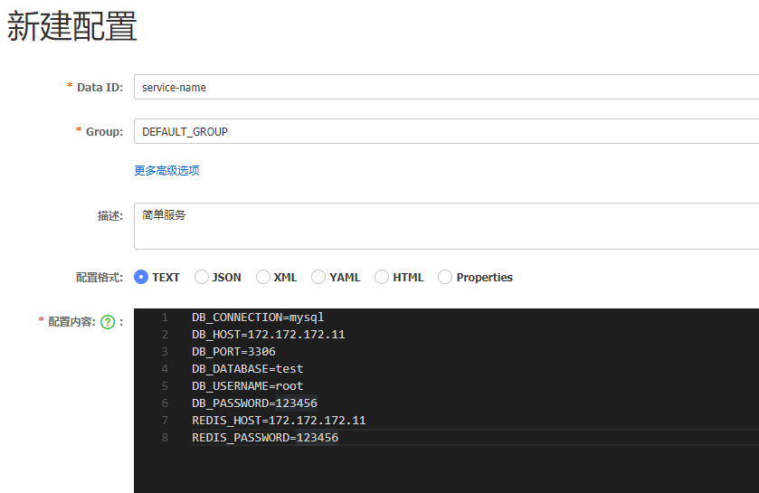
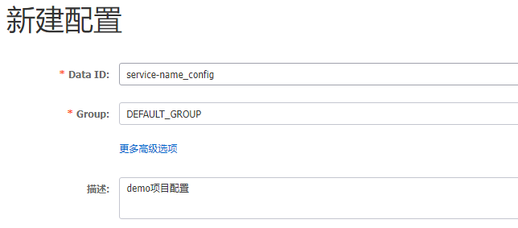
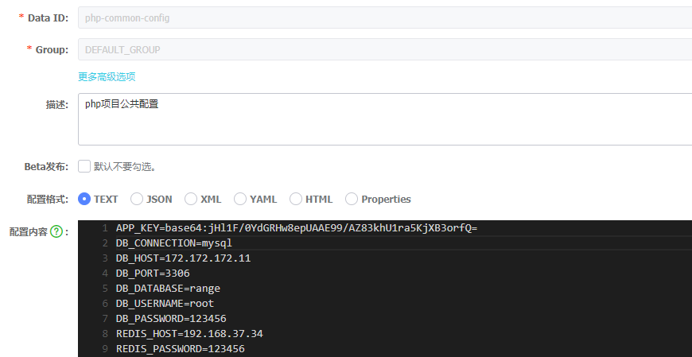

# 阿里巴巴nacos配置中心-Laravel客户端

## 功能

1. 客户端服务注册
2. 支持多模式配置和语言包下发
3. 服务间负载均衡
4. 集成supervisor守护进程
5. 配置兜底


## composer 安装

1. laravel项目`composer.json`添加`composer`安装事件

   ```
   "scripts": {
   	"post-install-cmd":[
           "@php artisan vendor:publish --provider=\"MapleSnow\\LaraNacos\\Providers\\ServiceProvider\""
       ]
   }
   ```

2. 安装composer依赖

    ```bash
    composer install alibaba/nacos
    ```
    
    如果没有出现`@php artisan vendor:publish --provider="MapleSnow\LaraNacos\Providers\ServiceProvider"
    Publishing complete.`, 请手动执行`php artisan vendor:publish --provider="MapleSnow\LaraNacos\Providers\ServiceProvider"
    `

## 配置

配置系统环境变量

```bash
# 客户端服务端口(默认80)
SERVER_PORT=1215
# nacos服务地址
LARAVEL_NACOS_HOST=192.168.37.13
# nacos服务端口
LARAVEL_NACOS_PORT=32664
# nacos分组ID
LARAVEL_NACOS_GROUPID=DEFAULT_GROUP
LARAVEL_NACOS_DATAID=service-name
# nacos租户ID(默认public)
LARAVEL_NACOS_TENANT=85dece02-efa2-4817-997e-6ceeb048dd3b
```

## 示例说明-配置管理

### 简单项目

>  管理项目包含的所有配置

1. 在nacos上添加配置

    

2. 运行脚本监听配置

   ```bash
   php artisan nacos:refresh
   ```

### 同时管理语言包和配置

> 可同时管理项目中配置和语言包

1. 在nacos上添加配置，配置添加`_config`后缀，语言包添加`_lang`后缀

   ​	

2. 运行脚本监听配置

   ```bash
   # 监听nacos服务配置变化
   php artisan nacos:refresh --type=config
   # 监听nacos服务语言包变化
   php artisan nacos:refresh --type=lang
   ```

   
### 公共配置管理

> 如果工程是微服务架构，由多个服务构成，同时共用一些基础系统配置

1. 在nacos上添加公共配置或公共语言包。

   默认使用`php-common_`作为前缀,可通过系统环境变量`LARAVEL_NACOS_PHP_COMMON_PREFIX`自定义前缀

   ​    

2. 去除原nacos中写入公共基础配置（若项目中有和公共配置相同的Key值，项目中优先级更高，既可以重写公共配置项）
3. 执行`同时管理语言包和配置`步骤1和步骤2

运行脚本监听配置

```bash
# 监听nacos公共配置变化
php artisan nacos:refresh --listen-comnon --type=config
# 监听nacos公共语言包变化
php artisan nacos:refresh --listen-common --type=lang
```

### 配置兜底

业务服务的配置通过有3种途径，可以尽最大可能保证项目正常启动和运行。

1. 第一优先级：从nacos配置中心获取
2. 第二优先级：从本地配置快照获取
3. 第三优先级：从本地默认配置获取

默认的本地配置文件目录为 `nacos/config/${NAMESPACE_ID}/${GROUP_ID}/${DATA_ID}`
默认的快照配置文件目录为 `nacos/snapshot/${NAMESPACE_ID}/${GROUP_ID}/${DATA_ID}`

## 项目示例-服务注册

### 服务注册

```bash
php artisan nacos:register:instance
```

### 服务持续心跳发送

```bash
php artisan nacos:beat:instance
```

### 其他服务管理命令

```bash
# 获取实例详情
php artisan nacos:get:instance
# 实例更新
php artisan nacos:update:instance
# 实例删除
php artisan nacos:delete:instance
```

### 项目示例-服务间负载均衡

通过`LARAVEL_NACOS_DATAID`查询nacos上服务节点，按轮询策略获取

```bash
# 测试用例
vendor/bin/phpunit vendor/maplesnow/nacos-laravel-client/tests/LoadBalanceTest.php
```

## Supervisor守护配置监听和心跳发送

依赖安装后会在composer.json 同级目录下会生成`supervisord/nacos.conf`配置文件， 其中包含三个进程: 配置监听(config-refresh)、语言包监听(lang-refresh)、心跳监听(service-beat)

```
supervisorctl update
supervisorctl start nacos:*
```

